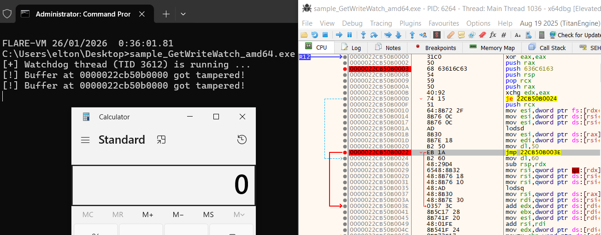

# Context

This technique uses Windows API `GetWriteWatch` to monitor memory pages for write operations, detecting debugger breakpoints. When a breakpoint is set (int 3 instruction), it triggers a write operation that can be detected.

Key characteristics:
- Allocates memory with `MEM_WRITE_WATCH` flag
- Uses watchdog thread to continuously monitor buffer
- Resets monitoring state with `ResetWriteWatch`
- Detects single write operations (breakpoint hits)
- Prints alert when tampering detected

# References

- https://anti-debug.checkpoint.com/techniques/misc.html#getwritewatch
- https://codeinsecurity.wordpress.com/2018/01/24/anti-debug-with-virtualallocs-write-watch/
- https://github.com/gsuberland/al-khaser/blob/write-watch/al-khaser/Anti%20Debug/WriteWatch.cpp