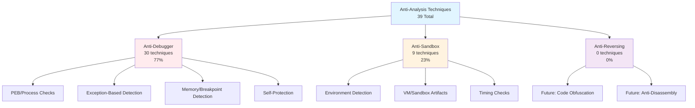

# Anti-Analysis Technique Collection

[](https://opensource.org/licenses/MIT)
[](https://en.wikipedia.org/wiki/C_(programming_language))
[](https://www.microsoft.com/windows)
[]()
[]()
[]()

> A comprehensive, practical collection of anti-analysis techniques used in modern malware, designed for security researchers, malware analysts, and reverse engineers.

## About

This repository documents 39 real-world anti-analysis techniques discovered during malware research and reverse engineering. Each technique is implemented as a standalone proof-of-concept with source code, build instructions, and detailed documentation.

**Purpose**: Educational resource for understanding how malware evades detection and analysis tools.

**Audience**: Security researchers, malware analysts, reverse engineers, and defensive security professionals.

**Technique Breakdown**:
- 🛡️ **Anti-Debugger** (30 techniques): Detect debuggers and prevent debugging
- 🔍 **Anti-Sandbox** (9 techniques): Detect sandboxes, VMs, and automated analysis
- 🔒 **Anti-Reversing** (0 techniques): Reserved for future code protection techniques

## Table of Contents

- [Anti-Analysis Technique Collection](#anti-analysis-technique-collection)
  - [About](#about)
  - [Table of Contents](#table-of-contents)
  - [Quick Start](#quick-start)
  - [Technique Categories](#technique-categories)
    - [Category Descriptions](#category-descriptions)
  - [Technique Index](#technique-index)
  - [Building Techniques](#building-techniques)
    - [Build System Overview](#build-system-overview)
      - [Docker + MinGW (Recommended)](#docker--mingw-recommended)
      - [Visual C++ (VC)](#visual-c-vc)
    - [General Build Process](#general-build-process)
    - [Build Requirements](#build-requirements)
    - [Troubleshooting](#troubleshooting)
  - [Contributing](#contributing)
  - [License](#license)
  - [Resources](#resources)
    - [Anti-Analysis References](#anti-analysis-references)
    - [Microsoft Documentation](#microsoft-documentation)
  - [Disclaimer](#disclaimer)

## Quick Start

Techniques are organized by category in dedicated directories:
- `anti-debugger/` - 30 techniques for detecting debuggers
- `anti-sandbox/` - 9 techniques for detecting sandboxes and VMs
- `anti-reversing/` - Reserved for future anti-reversing techniques

Each technique is in its own numbered directory (e.g., `anti-sandbox/001_SetErrorMode/`, `anti-debugger/008_IsDebuggerPresent/`). To explore a technique:

1. Navigate to the category directory, then technique subdirectory
2. Read the `README.md` for detailed explanation
3. Review the source code
4. Follow build instructions in the technique's README
5. Test in a safe, isolated environment

## Technique Categories

This collection organizes anti-analysis techniques into three main categories:



### Category Descriptions

- **Anti-Debugger** (30 techniques): Techniques that detect debuggers attached to or monitoring the process. Includes PEB checks, exception-based detection, breakpoint scanning, and self-protection mechanisms.

- **Anti-Sandbox** (9 techniques): Techniques that detect automated analysis environments, virtual machines, sandboxes, or analysis tools in the system. Includes environment checks, VM artifact detection, and timing-based detection.

- **Anti-Reversing** (0 techniques): Reserved for future techniques that actively hinder reverse engineering through code obfuscation, anti-disassembly, control flow flattening, or other code protection mechanisms. No techniques implemented yet.

> 📊 **Distribution**: 77% Anti-Debugger | 23% Anti-Sandbox | 0% Anti-Reversing

For detailed taxonomy and visual diagrams, see [docs/diagrams/taxonomy.md](docs/diagrams/taxonomy.md)

## Technique Index

| # | Technique Name | Category | Platform | Description |
| --- | --- | --- | --- | --- |
| [001](anti-sandbox/001_SetErrorMode/) | SetErrorMode | Anti-Sandbox | Windows | Detects sandbox by inspecting SetErrorMode behavior for hooks |
| [002](anti-sandbox/002_ForcedRaceConditionSleep/) | Forced Race Condition Sleep | Anti-Sandbox | Windows | Forces race condition to detect changes in sleep() behavior |
| [003](anti-sandbox/003_CheckProcessList/) | Check Process List | Anti-Sandbox | Windows | Scans process list for known analysis tool names |
| [004](anti-sandbox/004_CheckLoadedModules/) | Check Loaded Modules | Anti-Sandbox | Windows | Detects injected DLLs from analysis tools in current process |
| [005](anti-sandbox/005_CheckRegistryKeys/) | Check Device Names | Anti-Sandbox | Windows | Searches Windows Registry for VM-related device names |
| [006](anti-debugger/006_CheckProcessDebugPort/) | Check Process Debug Port | Anti-Debugger | Windows | Queries ProcessDebugPort via NtQueryInformationProcess |
| [007](anti-sandbox/007_CopyOfNtdll/) | Copy of ntdll.dll | Anti-Sandbox | Windows | Loads clean ntdll.dll copy to bypass hooked functions |
| [008](anti-debugger/008_IsDebuggerPresent/) | IsDebuggerPresent | Anti-Debugger | Windows | Checks PEB debug flag using IsDebuggerPresent API |
| [009](anti-debugger/009_CheckRemoteDebuggerPresent/) | CheckRemoteDebuggerPresent | Anti-Debugger | Windows | Detects debugger attached to specific process |
| [010](anti-sandbox/010_EnumWindowsProc/) | FindWindow | Anti-Sandbox | Windows | Searches for windows with known analysis tool names |
| [011](anti-debugger/011_ProcessDebugObjectHandle/) | ProcessDebugObjectHandle | Anti-Debugger | Windows | Queries ProcessDebugObjectHandle to detect debugging |
| [012](anti-debugger/012_CheckPEB/) | Check PEB | Anti-Debugger | Windows | Directly inspects debug flags in PEB structure |
| [013](anti-debugger/013_SetUnhandledExceptionFilter/) | SetUnhandledExceptionFilter | Anti-Debugger | Windows | Detects debugger takeover of exception handling chain |
| [014](anti-debugger/014_CloseHandle/) | CloseHandle Exception | Anti-Debugger | Windows | Checks if CloseHandle raises exception on invalid handle |
| [015](anti-debugger/015_SetHandleInformation/) | SetHandleInformation | Anti-Debugger | Windows | Abuses HANDLE_FLAG_PROTECT_FROM_CLOSE to detect debugger |
| [016](anti-debugger/016_RtlQueryProcessHeapInformation/) | RtlQueryProcessHeapInformation | Anti-Debugger | Windows | Detects debugger by examining heap flags |
| [017](anti-debugger/017_RtlQueryProcessDebugInformation/) | RtlQueryProcessDebugInformation | Anti-Debugger | Windows | Checks heap flags via RtlQueryProcessDebugInformation |
| [018](anti-sandbox/018_FindWindow/) | FindWindow (Debugger Titles) | Anti-Sandbox | Windows | Searches for window titles of known debuggers |
| [019](anti-sandbox/019_GetShellWindow/) | GetShellWindow | Anti-Sandbox | Windows | Compares parent PID against shell window PID |
| [020](anti-debugger/020_DbgPrint/) | DbgPrint Exception | Anti-Debugger | Windows | Detects debugger via DbgPrint exception behavior |
| [021](anti-debugger/021_GetWriteWatch/) | GetWriteWatch | Anti-Debugger | Windows | Monitors protected memory for debugger modifications |
| [022](anti-debugger/022_GetThreadContext/) | GetThreadContext | Anti-Debugger | Windows | Inspects hardware breakpoint registers (Dr0-Dr7) |
| [023](anti-debugger/023_NtSetInformationThread/) | NtSetInformationThread | Anti-Debugger | Windows | Hides thread from debugger using ThreadHideFromDebugger |
| [024](anti-debugger/024_NtQueryObject/) | NtQueryObject | Anti-Debugger | Windows | Enumerates object types looking for DebugObject |
| [025](anti-debugger/025_RaiseException/) | RaiseException DBG_CONTROL_C | Anti-Debugger | Windows | Raises DBG_CONTROL_C to detect exception interception |
| [026](anti-debugger/026_SoftwareBreakpoint/) | Memory Breakpoint INT3 | Anti-Debugger | Windows | Scans function memory for breakpoints (0xCC) |
| [027](anti-debugger/027_AntiStepOver/) | Anti-Step-Over | Anti-Debugger | Windows | Checks for breakpoint at function return address |
| [028](anti-debugger/028_MemoryBreakpoint/) | Guard Page | Anti-Debugger | Windows | Uses guard page exception to detect debugger |
| [029](anti-debugger/029_NtQueryVirtualMemory_WorkingSetList/) | NtQueryVirtualMemory WorkingSetList | Anti-Debugger | Windows | Checks working set page attributes for modifications |
| [030](anti-debugger/030_DbgBreakPoint_patch/) | DbgBreakPoint Patch | Anti-Debugger | Windows | Patches DbgBreakPoint to prevent debugger attachment |
| [031](anti-debugger/031_DbgUiRemoteBreakin_hook/) | DbgUiRemoteBreakin Hook | Anti-Debugger | Windows | Patches DbgUiRemoteBreakin to block debugger attachment |
| [032](anti-debugger/032_INT3/) | INT3 (0xC3) | Anti-Debugger | Windows | Uses vectored exception handler with INT3 instruction |
| [033](anti-debugger/033_INT3_long/) | INT3 Long Form (0xCD03) | Anti-Debugger | Windows | Uses long form of INT3 for debugger detection |
| [034](anti-debugger/034_INT2D/) | INT 2D | Anti-Debugger | Windows | Kernel debugger interrupt for detection |
| [035](anti-debugger/035_INT1/) | INT1 ICEBP (0xF1) | Anti-Debugger | Windows | Uses ICEBP instruction for debugger detection |
| [036](anti-debugger/036_INT1_long/) | INT1 Long Form (0xCD01) | Anti-Debugger | Windows | Two-byte form of INT 1 for detection |
| [037](anti-debugger/037_popfd_trap/) | POPFD Trap Flag | Anti-Debugger | Windows | Manipulates Trap Flag via POPFD to trigger single-step |
| [038](anti-debugger/038_INT1_prefix/) | INT1 with Prefixes | Anti-Debugger | Windows | Uses instruction prefixes before ICEBP |
| [039](anti-debugger/039_self_debugging/) | Self-Debugging | Anti-Debugger | Windows | Attempts to debug itself to detect existing debugger |

## Building Techniques

Most techniques include:

- **Source code** (`main.c` or similar in `src/` directory)
- **Makefile** for compilation
- **Dockerfile** for containerized builds
- **README** with detailed explanation and references

### Build System Overview

This project uses a **mixed build system** to accommodate different compilation requirements:

#### Docker + MinGW (Recommended)

Most techniques use Docker with MinGW cross-compiler for consistent builds:

```bash
# Build Docker image
make build-image

# Compile technique (builds both x86 and x64)
make build

# Or build directly if you have MinGW installed
make
```

Output binaries are placed in the `bin/` directory.

#### Visual C++ (VC)

Some techniques may require Visual C++ compiler on Windows:

```bash
# Build with Visual Studio developer command prompt
cl /Fe:technique.exe src/main.c
```

### General Build Process

1. **Navigate to technique directory**:
   ```bash
   cd anti-sandbox/001_SetErrorMode/
   # or
   cd anti-debugger/008_IsDebuggerPresent/
   ```

2. **Check build requirements** in the technique's README

3. **Build using Docker** (most techniques):
   ```bash
   make build-image  # First time only
   make build
   ```

4. **Or build with MinGW** (if installed):
   ```bash
   make
   ```

5. **Find compiled binaries** in `bin/` directory

### Build Requirements

- **Docker**: For containerized builds (recommended)
- **MinGW-w64**: For native Windows builds on Linux/Mac
- **Visual Studio**: For techniques requiring VC compiler
- **GNU Make**: Build automation

### Troubleshooting

- **Docker not available**: Install MinGW cross-compiler and build directly
- **MinGW not available**: Use Docker for isolated builds
- **Build failures**: Check individual technique README for specific requirements
- **Missing dependencies**: Some techniques may require additional libraries

Refer to individual technique READMEs for specific build requirements and platform compatibility.

## Contributing

Contributions are welcome! Please see [CONTRIBUTING.md](CONTRIBUTING.md) for guidelines on:

- Submitting new techniques
- Reporting issues
- Improving documentation
- Code style requirements

## License

This project is licensed under the MIT License - see the [LICENSE](LICENSE) file for details.

## Resources

### Anti-Analysis References

- [CheckPoint Anti-Debug Techniques](https://anti-debug.checkpoint.com/)
- [Al-Khaser Anti-Malware Scanner](https://github.com/LordNoteworthy/al-khaser)
- [Malware Analysis Bootcamp](https://www.malwaretech.com/)

### Microsoft Documentation

- [Windows API Documentation](https://docs.microsoft.com/en-us/windows/win32/api/)
- [Undocumented NT Internals](http://undocumented.ntinternals.net/)

## Disclaimer

This repository is for **educational and research purposes only**. The techniques documented here are used by malware authors to evade detection. Understanding these techniques helps security professionals build better defenses.

**Do not use these techniques for malicious purposes.**

---

**Note**: Some techniques may not work on all Windows versions or with all debuggers. Compatibility notes are included in individual technique documentation where applicable.
