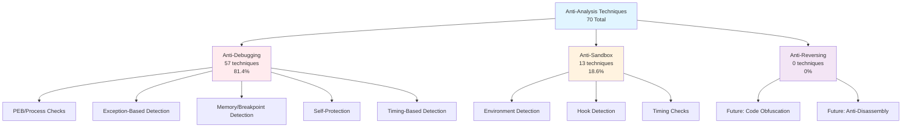
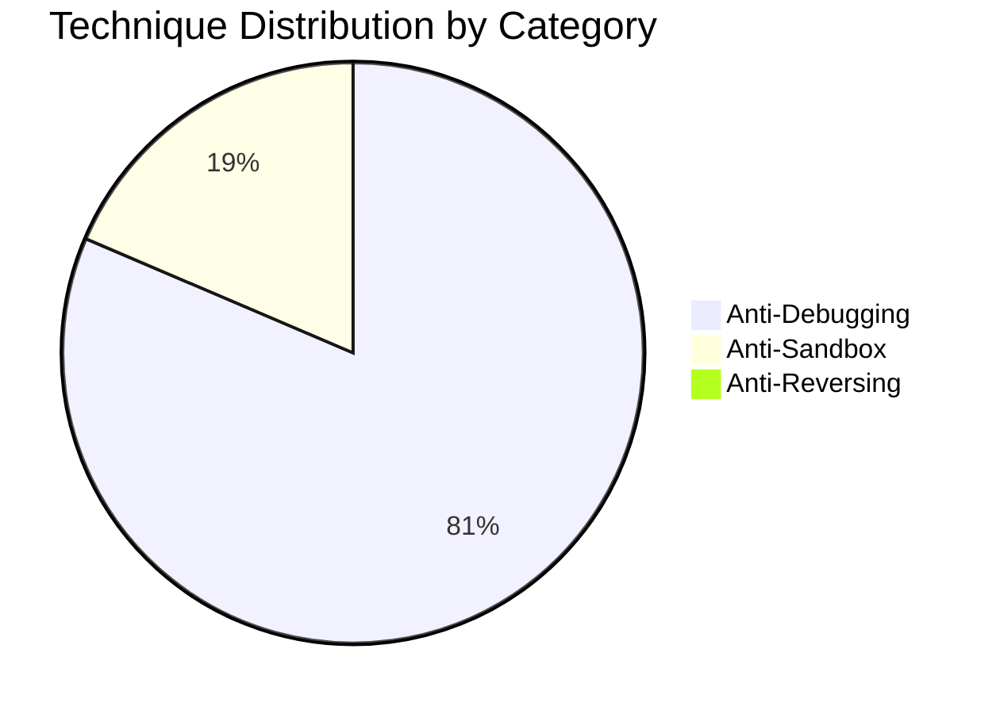
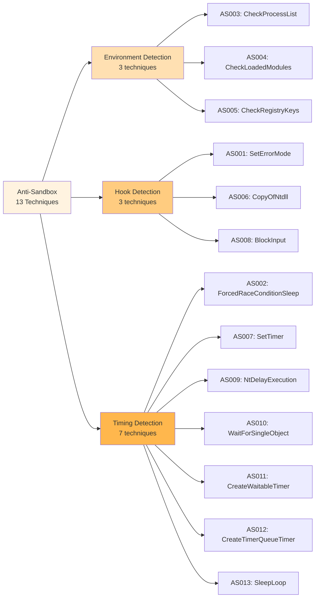
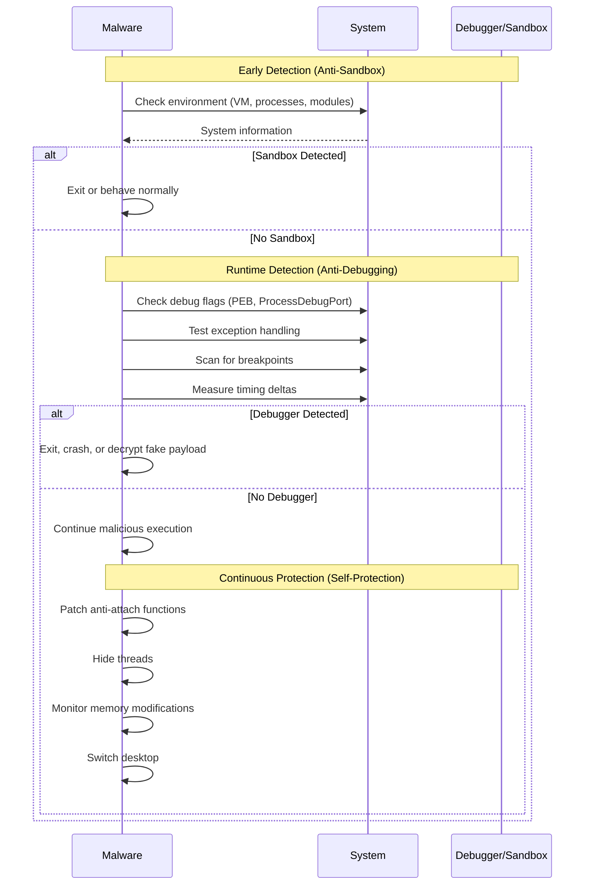
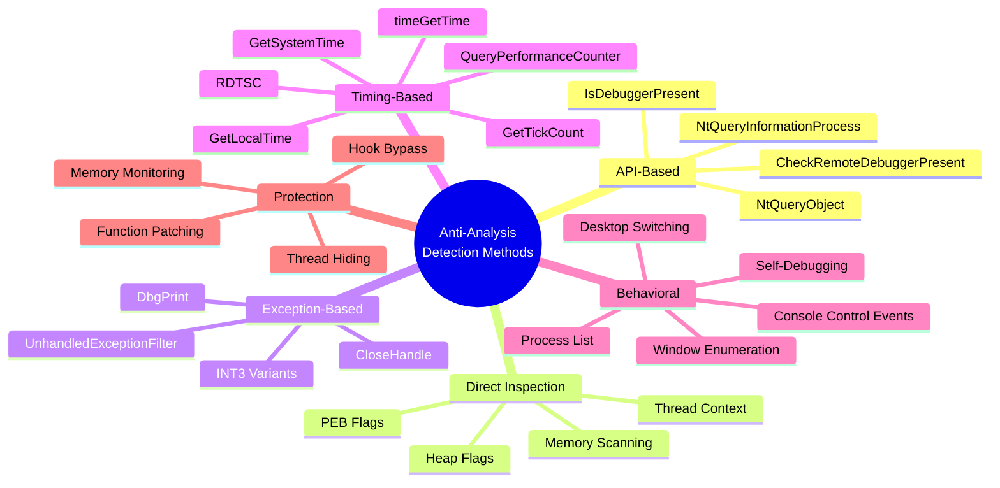
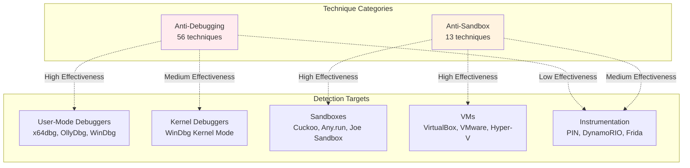

# Anti-Analysis Technique Taxonomy

This document contains visual diagrams showing the organization and relationships of anti-analysis techniques in this repository.

## Main Taxonomy



## Distribution Chart



## Anti-Debugging Techniques (57)

```mermaid
graph LR
    AD[Anti-Debugging<br/>57 Techniques]

    AD --> PEB[PEB & Process Info<br/>12 techniques]
    AD --> EXC[Exception-Based<br/>14 techniques]
    AD --> MEM[Memory & Breakpoints<br/>7 techniques]
    AD --> SELF[Self-Protection<br/>5 techniques]
    AD --> TIME[Timing-Based<br/>6 techniques]
    AD --> OTHER[Other Detection<br/>13 techniques]

    PEB --> PEB1[AD001: CheckProcessDebugPort]
    PEB --> PEB2[AD002: IsDebuggerPresent]
    PEB --> PEB3[AD003: CheckRemoteDebuggerPresent]
    PEB --> PEB4[AD004: ProcessDebugObjectHandle]
    PEB --> PEB5[AD005: CheckPEB]
    PEB --> PEB6[AD015: NtQueryObject]
    PEB --> PEB7[AD040: ProcessDebugFlags]
    PEB --> PEB8[AD041: NtGlobalFlag]
    PEB --> PEB9[AD042: HeapFlags]
    PEB --> PEB10[AD047: SystemKernelDebuggerInformation]
    PEB --> PEB11[AD050: KUSER_SHARED_DATA]
    PEB --> PEB12[AD051: HEAP_TAIL_CHECKING_ENABLED]

    EXC --> EXC1[AD006: SetUnhandledExceptionFilter]
    EXC --> EXC2[AD007: CloseHandle]
    EXC --> EXC3[AD008: SetHandleInformation]
    EXC --> EXC4[AD011: DbgPrint]
    EXC --> EXC5[AD016: RaiseException]
    EXC --> EXC6[AD023: INT3]
    EXC --> EXC7[AD024: INT3_long]
    EXC --> EXC8[AD025: INT_2D]
    EXC --> EXC9[AD026: INT1]
    EXC --> EXC10[AD027: INT1_long]
    EXC --> EXC11[AD028: popfd_trap]
    EXC --> EXC12[AD029: INT1_prefix]
    EXC --> EXC13[AD052: InstructionCounting]
    EXC --> EXC14[AD053: StackSegment]

    MEM --> MEM1[AD012: GetWriteWatch]
    MEM --> MEM2[AD017: SoftwareBreakpoint]
    MEM --> MEM3[AD018: AntiStepOver]
    MEM --> MEM4[AD019: MemoryBreakpoint]
    MEM --> MEM5[AD020: NtQueryVirtualMemory]
    MEM --> MEM6[AD045: CodeChecksum]
    MEM --> MEM7[AD049: DetectAPIPatch]

    SELF --> SELF1[AD014: NtSetInformationThread]
    SELF --> SELF2[AD021: DbgBreakPoint_patch]
    SELF --> SELF3[AD022: DbgUiRemoteBreakin_hook]
    SELF --> SELF4[AD030: self_debugging]
    SELF --> SELF5[AD034: SwitchDesktop]

    TIME --> TIME1[AD035: GetLocalTime]
    TIME --> TIME2[AD036: GetSystemTime]
    TIME --> TIME3[AD037: GetTickCount]
    TIME --> TIME4[AD038: QueryPerformanceCounter]
    TIME --> TIME5[AD039: timeGetTime]
    TIME --> TIME6[AD043: RDTSC]

    OTHER --> OTH1[AD009: RtlQueryProcessHeapInformation]
    OTHER --> OTH2[AD010: RtlQueryProcessDebugInformation]
    OTHER --> OTH3[AD013: GetThreadContext]
    OTHER --> OTH4[AD031: GenerateConsoleCtrlEvent]
    OTHER --> OTH5[AD032: GetShellWindow]
    OTHER --> OTH6[AD033: FindWindow]
    OTHER --> OTH7[AD044: OpenProcess_CSRSS]
    OTHER --> OTH8[AD046: CreateFileA_Exclusive]
    OTHER --> OTH9[AD048: LoadLibrary]
    OTHER --> OTH10[AD054: EnumWindowsProc]
    OTHER --> OTH11[AD055: DbgSetDebugFilterState]
    OTHER --> OTH12[AD056: SwitchToThread]
    OTHER --> OTH13[AD057: TLSCallback]

    style AD fill:#ffebee
    style PEB fill:#ffcdd2
    style EXC fill:#ef9a9a
    style MEM fill:#e57373
    style SELF fill:#ef5350
    style TIME fill:#ff8a65
    style OTHER fill:#f44336
```



## Anti-Sandbox Techniques (13)



## Technique Timeline (Execution Flow)



## Detection Method Categories



## Effectiveness Matrix



## Related Techniques Network

```mermaid
graph TD
    subgraph Core Detection Methods
        PEB[PEB Inspection]
        HEAP[Heap Flags]
        EXC[Exception Handling]
        MEM[Memory Scanning]
        TIMING[Timing Analysis]
    end

    subgraph Specific Techniques
        T002[AD002: IsDebuggerPresent]
        T005[AD005: CheckPEB]
        T009[AD009: RtlQueryProcessHeapInformation]
        T010[AD010: RtlQueryProcessDebugInformation]
        T006[AD006: SetUnhandledExceptionFilter]
        T016[AD016: RaiseException]
        T023[AD023-029: INT Instructions]
        T017[AD017: SoftwareBreakpoint]
        T018[AD018: AntiStepOver]
        T020[AD020: NtQueryVirtualMemory]
        T035[AD035-039: Timing Checks]
    end

    PEB --> T002
    PEB --> T005
    HEAP --> T009
    HEAP --> T010
    EXC --> T006
    EXC --> T016
    EXC --> T023
    MEM --> T017
    MEM --> T018
    MEM --> T020
    TIMING --> T035

    style PEB fill:#e3f2fd
    style HEAP fill:#e8f5e9
    style EXC fill:#fff3e0
    style MEM fill:#fce4ec
    style TIMING fill:#f3e5f5
```



## Usage Examples

### Including in README
```markdown
## Technique Taxonomy


```

### Filtering by Category
- Use the categorization to filter techniques in documentation
- Group related techniques when discussing detection strategies
- Show progression from simple to complex methods

---

**Last Updated**: 2026-02-18
**Total Techniques**: 70
**Categories**: 3 (Anti-Debugging, Anti-Sandbox, Anti-Reversing)
